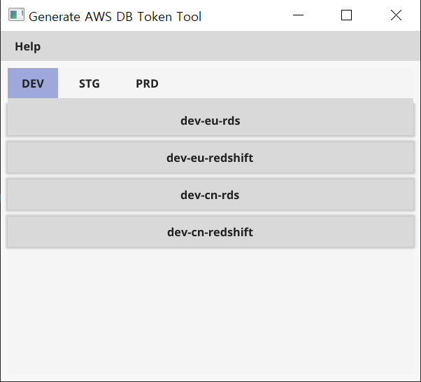

# misoboy/go-aws-generate-db-token

AWS Generate IAM DB Token in Go GUI.

## Installation

```
go get -u github.com/misoboy/go-aws-generate-db-token
```

## Examples

| [Screenshot](examples) |
| --- |
| |

## Overview

AWS IAM DB Token creation also has an AWS CLI, but it provides a GUI to help you create it easily.

In the PRD environment, it is assumed that MFA is activated and the OTP CODE is input.

## Usage

Run windows cmd
Go to the project workspace root path.
```
> set GOROOT=Go Lang installation path
> set GOPATH=Project Workspace Path
> go build -o aws-generate-db-token.exe ./main.go
```

Before running the exe file, you need to modify the `conf/env.conf` file.
```conf
[_GLOBAL_SECTION_]

[dev-eu]
PROFILE=AWS CLI Profile Name
RDS_HOSTNAME=AWS RDS Service Endpoint
RDS_PORT=AWS RDS Service Port
RDS_USERNAME=AWS RDS Username
REDSHIFT_CLUSTER_ID=AWS Redshift Cluster ID
REDSHIFT_USERNAME=AWS Redshift Username
...
```

Generate the token by running the exe file.
