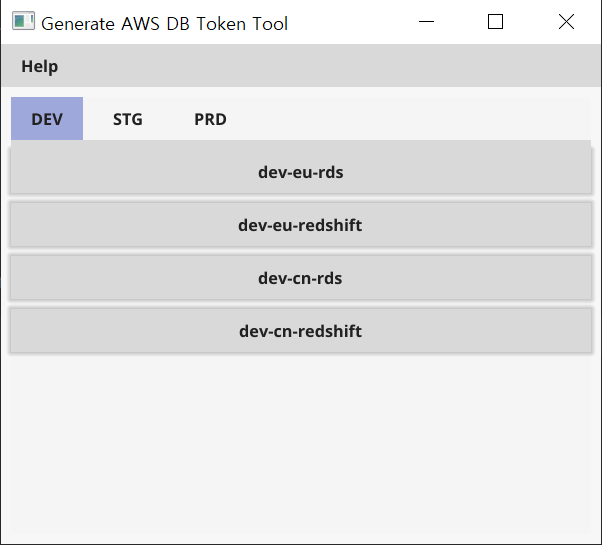

# go-aws-generate-db-token

> A Go GUI desktop tool for generating **AWS IAM database authentication tokens** for RDS and Redshift — with MFA/OTP support.

[](https://golang.org)
[](https://aws.amazon.com)
[](https://github.com/misoboy/go-aws-generate-db-token)
[](https://github.com/misoboy/go-aws-generate-db-token)

## Overview

AWS CLI can generate IAM DB tokens but it requires command-line usage which is cumbersome for production access. This tool provides a **native GUI** to:

- Input AWS credentials and region
- Enter MFA OTP code (for MFA-enabled environments)
- Generate an IAM DB authentication token for RDS or Redshift
- Copy the token for use in database clients

| Screenshot |
|-----------|
|  |

## Prerequisites

- Go 1.16+
- Windows (primary target) or cross-platform build

## Installation

```bash
go get -u github.com/misoboy/go-aws-generate-db-token
```

## Build

```bash
# Windows
set GOROOT=<Go installation path>
set GOPATH=<Project workspace path>
go build -o aws-generate-db-token.exe github.com/misoboy/go-aws-generate-db-token

# Linux/macOS
go build -o aws-generate-db-token github.com/misoboy/go-aws-generate-db-token
```

## Project Structure

```
.
├── main.go       # Entry point and GUI setup
├── rds/          # RDS token generation
├── redshift/     # Redshift token generation
├── common/       # Shared AWS utilities
├── conf/         # Configuration
└── examples/     # Screenshots and usage examples
```

## License

MIT
